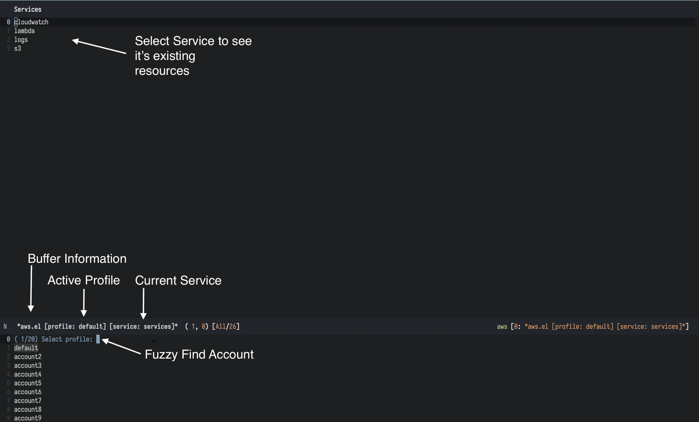
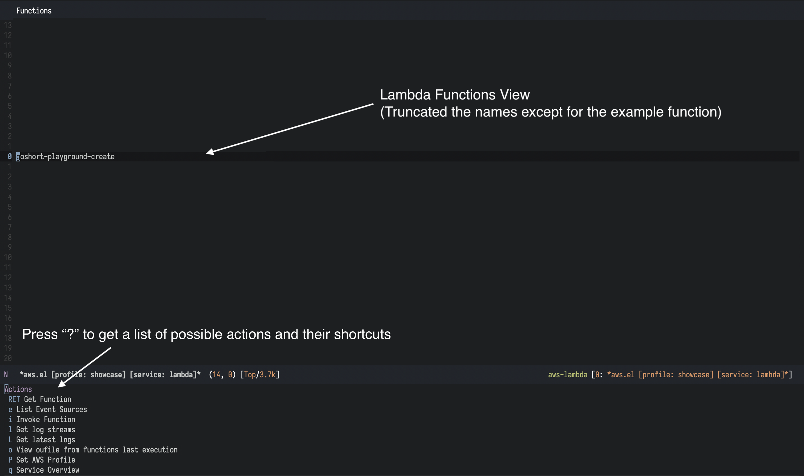
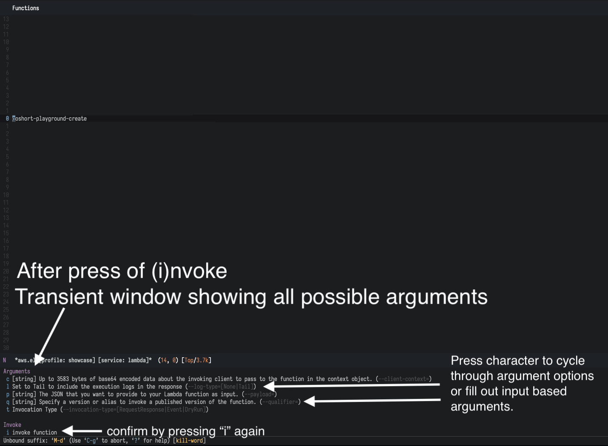

# aws.el
[](https://github.com/snowiow/aws.el/actions)

Emacs major modes wrapping the AWS CLI. 

aws.el is a magit style interface to the AWS command line client. It makes heavy
use of of the `transient` package and `tabulated-list-mode` to make the AWS
command line interface as discoverable, easy and fast to navigate as possible.

# Install

This is a free time projects of mine, which is still in the very beginning and I
currently add functionality as I see use cases for it in my day to day
life. Therefore I don't want to add it to a package repository like
[melpa](https://melpa.org/) yet, because I see it as pre-alpha software at the
moment.

However you could either use
[straight.el](https://github.com/raxod502/straight.el) or directly clone it from
Github and load it via [use-package](https://github.com/jwiegley/use-package)
like I do:

```elisp
(use-package aws-mode
  :load-path "~/.emacs.d/packages/awscli"
  :custom
  (aws-vault t)
  (aws-output "json")) ;; optional: yaml, json, text (default: yaml)

(use-package aws-evil
  :after (aws-mode evil)
  :load-path "~/.emacs.d/packages/awscli")
```

# Design

The general design is to have a [tabulated list
view](https://www.gnu.org/software/emacs/manual/html_node/elisp/Tabulated-List-Mode.html)
for every AWS CLI supported service, which lists up the existing resources of
that service. 

You should be able to interact with each element of the list via
different key presses. Flags and additional arguments should be easily activated
in transient views ([See screenshot](#transient-view-lambda-function-invoke)).

You should also always be able to press `?` in every tabulated list view to get
a help menu ([See screenshot](#help-menu-lambda)), which shows all the possible
actions and the respective shortcut.

This general Emacs Mode design should make it possible to learn the package just
by navigating around and typing `?`. As you get familiar with shortcuts you
should be able to navigate and do actions a lot faster then typing out the
commands in the AWS CLI itself.

# Features
- Switch between your configured profiles
- Login to the AWS UI via `aws-vault login`
- Works with the `--profile` flag as well as aws-vault sessions
- CloudFormation
    - List Stacks
    - Delete Stack
- CloudWatch
    - List CloudWatch Alarms in Account
        - Enable/Disable ActionsEnabled field 
- Lambda
    - List Lambda Functions in Account
    - Describe Lambda Function
    - Invoke Lambda Function and see last invocation result
    - Get latest logs
    - Get all Log Groups
    - List Event Source Mappings
        - Describe Event Source Mapping
        - Update Event Source Mapping
- Logs
    - List Log Groups in Account 
    - Get Log Streams of a Log Group
        - Describe Log Stream
        - Get Log Events
- S3
    - List S3 Buckets
    - Create Bucket

## Images of selected Features
### Main View with Switch Profile Auto Completion open

### Help Menu Lambda

### Transient View Lambda Function Invoke


# Configuration

## Activate aws-vault for profiles

Set `(aws-vault t)` to use aws-vault to login to a profile.
`(aws-vault nil)` or omitting the setting uses the `--profile` flag of the AWS
CLI itself.

# Current Limitations
## AWS-Vault MFA Shell Prompts don't work in aws.el
For now set the `AWS_VAULT_PROMPT` environment variable to a UI utility like
`osascript`.

# Inspirations

This project is inspired by other great Emacs packages like:
- [magit](https://github.com/magit/magit)
- [kubel](https://github.com/abrochard/kubel)
